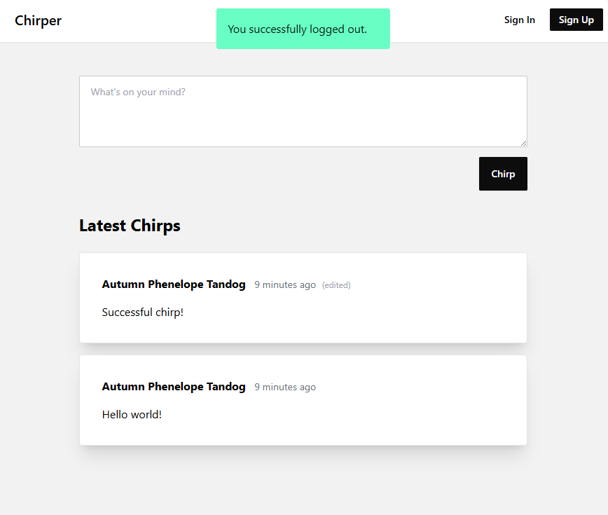
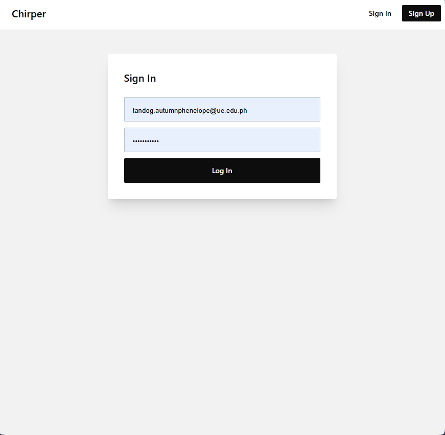
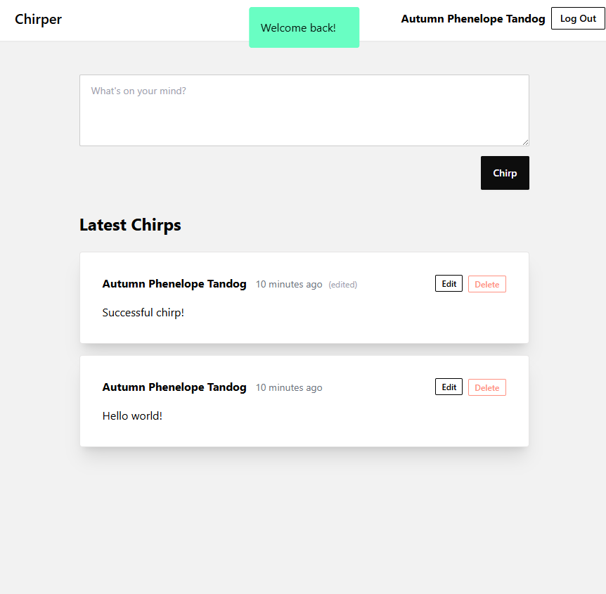
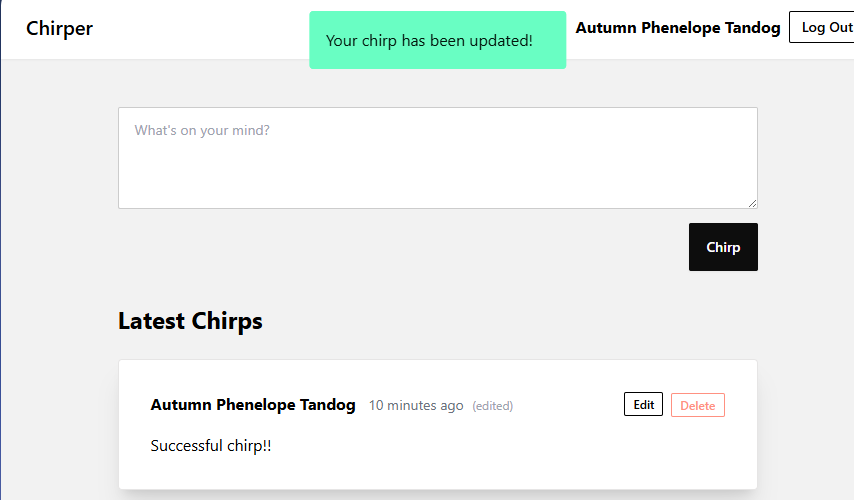
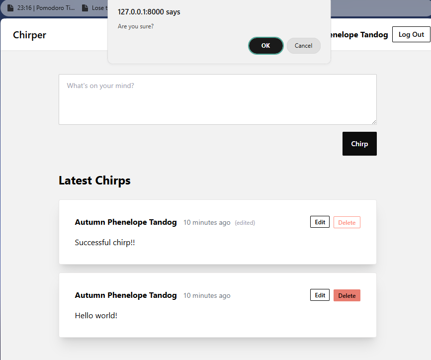
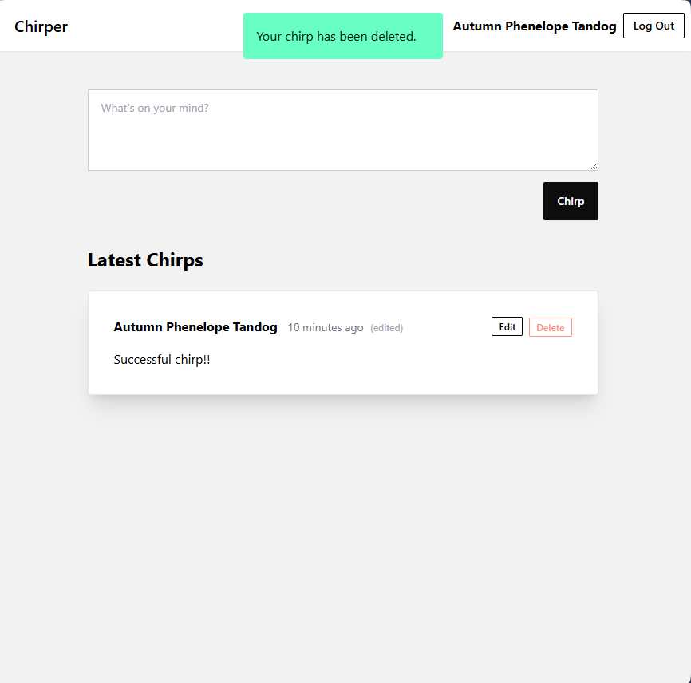
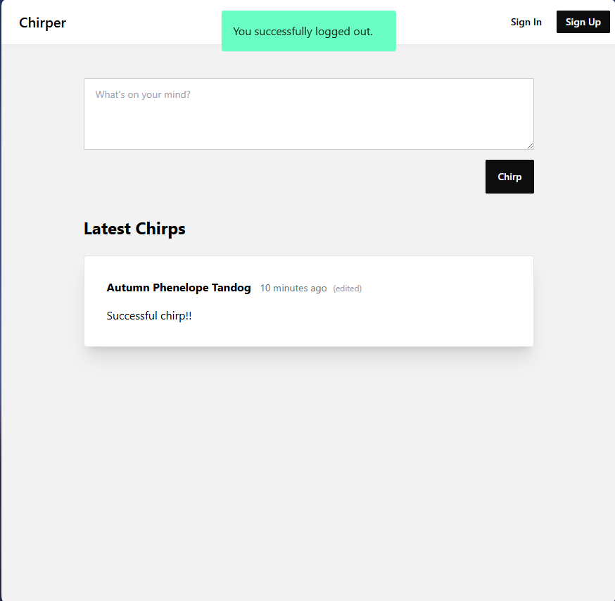

# Laravel Chirper Application Documentation

## What I built

The main project was originally based on following a Laravel guide for creating a basic To-Do List application. Instead of creating a traditional to-do list, I applied the same Laravel concepts and mechanics to build a Chirper-style application where users can create an account, log in, and post short messages called chirps.

Although the final application is not a to-do list, it follows the same core Laravel structure used in a typical task management project. The application uses routes, controllers, models, migrations, Blade views, authentication, database relationships, validation, and CRUD-style operations. The main difference is that instead of creating, editing, and deleting tasks, the user creates, edits, and deletes chirps.

This helped me understand how Laravel can be used to build different types of applications while still following the same development pattern.

## Summary of changes

### Laravel project setup

Set up a Laravel application by installing the required PHP dependencies using Composer and frontend dependencies using npm. The project was prepared by creating the environment file, generating the Laravel application key, running migrations, and serving the application locally using:

```bash
php artisan serve
```

This setup allowed the Laravel application to run properly in the browser.

### Authentication system

Implemented a basic authentication flow where users can register, log in, and log out. This follows the same concept needed in many Laravel applications, including a to-do list system where tasks are usually connected to a specific user account.

The authentication system allows each user to have their own identity inside the application. This makes it possible to associate created chirps with the user who posted them.

### Chirp model and database structure

Created a `Chirp` model and migration to store short user posts in the database. This works similarly to a to-do list item model, except the stored data is a message instead of a task title or task description.

The chirps table stores important information such as the chirp message, the user who created it, and the timestamps for when it was created or updated.

### User and chirp relationship

Added a relationship between the `User` model and the `Chirp` model. Each user can have many chirps, and each chirp belongs to one user.

This is similar to a to-do list app where one user can have many tasks. The same Laravel relationship logic applies:

```php
public function chirps(): HasMany
{
    return $this->hasMany(Chirp::class);
}
```

This helped demonstrate how Laravel uses Eloquent relationships to connect database tables.

### CRUD-style functionality

Implemented CRUD-style mechanics for chirps. Users can create a chirp, view chirps, edit their own chirps, and delete their own chirps.

This follows the same basic functionality of a Laravel to-do list application:

```txt
To-Do List App: create, view, edit, delete tasks
Chirper App: create, view, edit, delete chirps
```

Because of this, the project still follows the same learning objective as the original to-do list guide.

### Authorization and ownership

Added authorization logic so that users can only edit or delete their own chirps. This is important because users should not be able to modify content created by other users.

This same logic would also apply in a to-do list system, where each user should only be able to manage their own tasks.

### Blade views and layout

Created Blade views to display the home page, chirp feed, forms, and authentication pages. Blade was used to connect the backend Laravel data with the frontend interface.

The views allow users to interact with the application by submitting forms, viewing posts, and navigating between pages.

### Validation

Added validation to make sure submitted chirps are not empty and do not exceed the allowed message length. This helped prevent invalid data from being saved into the database.

This is similar to validating a to-do list form where a task title or description must be required before saving.

### Laravel configuration and debugging

During development, several setup and configuration issues were encountered and fixed. These included missing Composer dependencies, missing Vite dependencies, missing application key, broken CSS loading, Git tracking issues, and a broken Laravel configuration file.

One major issue was caused by the `config/filesystems.php` file accidentally containing the text `composer update`, which caused the website to display incorrectly. This was fixed by restoring the proper Laravel filesystem configuration.

## What I learned

The biggest lesson I learned from this project was that Laravel applications follow a reusable structure. Even though the original guide focused on making a to-do list, I was able to apply the same ideas to create a Chirper-style application. This helped me understand that the important part is not just the type of app being built, but the Laravel mechanics behind it.

I learned how routes connect URLs to controller methods, how controllers handle logic, how models represent database tables, and how migrations define the database structure. I also learned how Blade views display data and how forms send user input back to Laravel.

Another important lesson was understanding Eloquent relationships. The connection between users and chirps is similar to the connection between users and tasks in a to-do list app. This helped me understand how Laravel manages related data in a clean and organized way.

I also learned the importance of authentication and authorization. Creating accounts and restricting users to only edit or delete their own chirps showed me how Laravel can protect user-specific data.

Lastly, I learned a lot about debugging Laravel setup issues. I became more familiar with commands like:

```bash
composer install
npm install
php artisan key:generate
php artisan migrate
php artisan optimize:clear
php artisan view:clear
php artisan serve
```

These commands helped me understand the setup process required to run a Laravel project properly.

## What confused me

One thing that confused me at first was the difference between the original to-do list guide and the Chirper application I created. The final output was different, but the underlying Laravel concepts were still the same. I eventually understood that a to-do item and a chirp are both database records that can be created, viewed, edited, and deleted.

I was also confused by the difference between `composer install`, `composer update`, `npm install`, `npm run dev`, and `php artisan serve`. At first, I thought some of these commands would directly open the website, but I learned that each one has a different purpose. Composer handles PHP dependencies, npm handles frontend dependencies, and `php artisan serve` starts the Laravel development server.

Another confusing part was debugging why the website only showed the text `composer update`. The problem was not in the route or Blade file, but inside `config/filesystems.php`. This taught me that Laravel errors can sometimes come from unexpected files.

Git was also challenging because I accidentally initialized Git in the wrong folder, causing Windows system folders such as `AppData`, `Documents`, and `.vscode` to appear in Git status. This helped me learn to always check the current folder using:

```bash
pwd
ls
git status
```

before running:

```bash
git add .
```

## Final result

The final result is a Laravel Chirper application that applies the same mechanics as a Laravel to-do list project. Instead of managing tasks, the application manages user-created chirps.

The project demonstrates the following Laravel concepts:

```txt
Routes
Controllers
Models
Migrations
Blade views
Authentication
Authorization
Validation
Eloquent relationships
CRUD operations
Git workflow
```

The application can be started using:

```bash
php artisan serve
```

Then opened in the browser at:

```txt
http://127.0.0.1:8000
```

## Screenshot

Add screenshot here showing the Laravel Chirper application running successfully.

Example:

```txt







```
